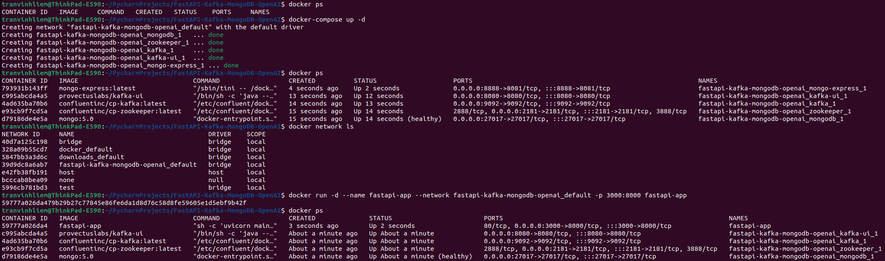
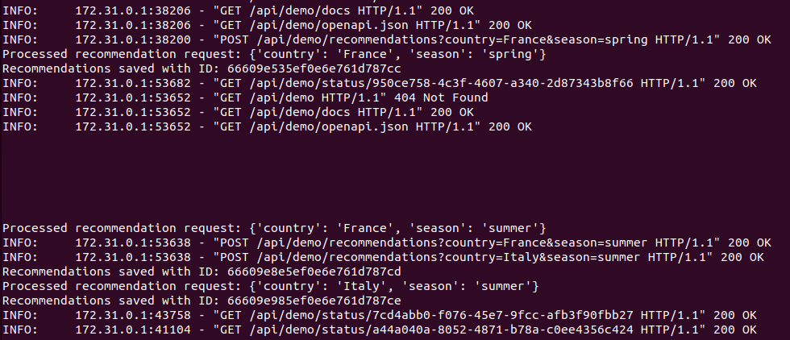

# FastAPI-Kafka-MongoDB-OpenAI

Create a scalable FastAPI application that serves an endpoint to recommend three things to do in a given country during a specific season by consulting the OpenAI API. 

Additionally, integrate a distributed component for background processing to handle the OpenAI API calls asynchronously, store the results in MongoDB, and signal completion. 


## Installation & Usage

This project running on Python 3.11, so please be sure that you are install Python 3.11 on your machine

````bash
sudo add-apt-repository ppa:deadsnakes/ppa
sudo apt update 
sudo apt install python3.11
`````

Use the package manager [pip](https://pip.pypa.io/en/stable/)

````bash
sudo apt-get install python3-pip
`````

````bash
python3.11 -m pip install virtualenv
python3.11 -m venv <virtual-environment-name>
`````

activate the virtual environment

````bash
source <virtual-environment-name>/bin/activate
`````
to install packages.

```bash
python3.11 -m pip install -r requirements.txt 
```

To run this project, you will need to add the following environment variables to your `app/core/config.py` or `app/core/settings.cfg` file

- `KAFKA_BOOTSTRAP_SERVERS`
- `KAFKA_TOPIC`
- `MONGODB_URI`
- `MONGODB_DATABASE`
- `OPENAI_KEY`


Running a script

```bash
# Run a uvicorn service to serve FastAPI 
uvicorn main:app --host 0.0.0.0 --port 3000

# Run a background worker
python3.11 background-worker.py
```

## Docker



In the project, I have declared [docker compose](https://docs.docker.com/compose/install/linux/#install-using-the-repository) file to create Kafka Zookeeper/Kafka/MongoDB services

````bash
docker-compose -f docker-compose.yml up -d
```````

when all the containers are up, we need to check for the network name which being used to run with those services

````bash
docker network ls
```````

```bash
docker build -f docker/Dockerfile -t <container-name> .
docker run --name fastapi-app --network <name-of-network-found-above> -p 3000:8000 <container-name> -d
```

Now, the FastAPI run on port 3000 at your machine




